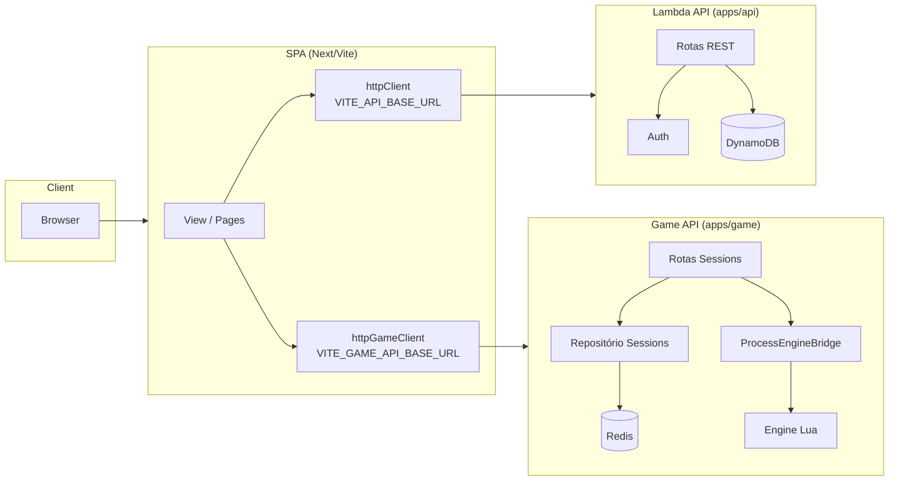

# Visão geral da arquitetura

Documento de referência única: como se encaixam **Lambda API**, **Game API** e **Engine Lua**, quem faz o quê e quando o frontend chama cada sistema.

---

## Diagrama de alto nível

**Componentes:**

| Componente        | Descrição |
|-------------------|-----------|
| **Browser**       | Usuário acessa a aplicação. |
| **SPA**           | Frontend (apps/spa). Renderiza UI e decide qual API chamar. |
| **Lambda API**    | apps/api. Autenticação, usuário, inventário, loja, ranking, persistência em DynamoDB. |
| **Game API**      | apps/game. Partida em tempo (quase) real: criar sessão, carregar sessão, executar step. |
| **Engine Lua**    | packages/engine. Regras do jogo, estado da partida, stateless por request. |
| **DynamoDB**      | Dados de plataforma (usuários, projetos, todos, etc.). Acessado apenas pela Lambda. |
| **Redis**         | Cache/persistência de sessões de partida (session state). Acessado apenas pelo Game API. |

---

## Responsabilidades por sistema

### Lambda API (apps/api)

- **Auth:** login (ex.: Google), JWT, sessão do usuário.
- **Usuário e dados de plataforma:** perfil, preferências, projetos, tarefas (todos).
- **Inventário / loja / ranking:** quando existirem, ficam na Lambda e no Dynamo.
- **Persistência:** DynamoDB. A Lambda **não** participa do loop da partida (criar session, step).
- **Regra:** Lambda **não** contém lógica de gameplay (vida, mana, cartas, turnos).

### Game API (apps/game)

- **Orquestração da partida:** recebe `POST /sessions`, chama a engine (init), persiste no Redis, devolve `sessionId` e state.
- **Recuperar partida:** `GET /sessions/:id` — lê state do Redis (ou fallback) e devolve ao cliente.
- **Executar ação:** `POST /sessions/:id/step` — carrega state do repositório, chama engine (step), persiste novo state, retorna state e events.
- **Persistência de sessões:** Redis (key `session:{sessionId}`, value JSON). Game server **não** acessa DynamoDB direto; se precisar de dados de usuário, usa Lambda ou contrato definido (ex.: deck vindo do cliente ou da Lambda).
- **Bridge Node–Lua:** spawna processo Lua, envia JSON pelo stdin, recebe JSON pelo stdout; sem lógica de regras no Node.

### Engine Lua (packages/engine)

- **Fonte da verdade do estado da partida:** vida, mana, mão, deck, tabuleiro, fase, turno.
- **Comandos:** `init` (cria estado inicial, sessionId, jogador e inimigo) e `step` (aplica ação e devolve novo state e events).
- **Stateless por request:** não mantém conexão; a cada request recebe state (ou options no init) e devolve state atualizado.
- **Regras:** validação de ações por fase, custo de mana, dano, condição de vitória/derrota, etc.

### SPA (apps/spa)

- **Duas bases de URL:** `VITE_API_BASE_URL` (Lambda) e `VITE_GAME_API_BASE_URL` (Game).
- **httpClient:** chamadas à Lambda (auth, dados de usuário, projetos, etc.).
- **httpGameClient:** chamadas ao Game API (sessions, step).
- **Fluxo de partida:** Hub → Start Match (POST /sessions) → Match (GET /sessions/:id, POST /sessions/:id/step).

---

## Quando o frontend chama cada API

| Fluxo / necessidade        | API usada   | Cliente no SPA   | Exemplo de uso |
|----------------------------|------------|------------------|-----------------|
| Login / autenticação       | Lambda API | `httpClient`     | OAuth, token, sessão |
| Dados do usuário / perfil  | Lambda API | `httpClient`     | Perfil, preferências |
| Projetos, todos, listas    | Lambda API | `httpClient`     | CRUD de projetos e tarefas |
| Iniciar partida            | Game API   | `httpGameClient` | `POST /sessions` |
| Carregar partida           | Game API   | `httpGameClient` | `GET /sessions/:id` |
| Jogar carta / atacar / fim de fase | Game API | `httpGameClient` | `POST /sessions/:id/step` com `action` |

**Resumo:** tudo que é **plataforma** (auth, usuário, dados persistentes em Dynamo) → **Lambda**. Tudo que é **partida em andamento** (criar sessão, state, step) → **Game API**.

---

## Referências

- **Plano e conceitos:** `apps/game/docs/PASSO-A-PASSO-PVE-E-CONCEITOS.md`
- **Decisões Game ↔ Lambda:** `apps/game/docs/ARCHITECTURE-DECISIONS.md`
- **Status e próximos passos:** `apps/game/docs/STATUS-E-PROXIMOS-PASSOS.md`
- **Variáveis de ambiente do SPA:** `VITE_API_BASE_URL`, `VITE_GAME_API_BASE_URL` (ver `apps/spa/.env.example` e `apps/spa/src/app/config/environment.ts`)
